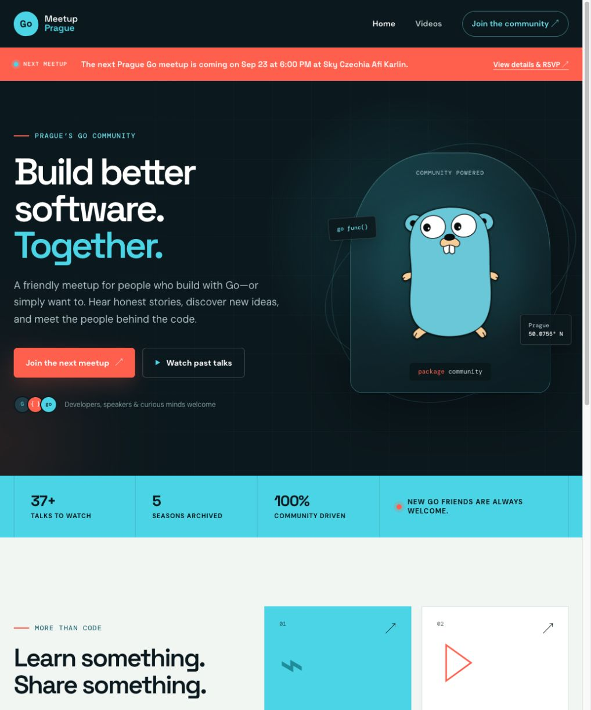

# Go Meetup Prague

The website for Prague's Go community: upcoming meetups, community links, and recordings from past talks.

[Visit the website](https://www.gomeetupprague.cz/)



## Develop locally

You need [Hugo](https://gohugo.io/installation/) and Node.js with npm. Go is only required when changing the video update tooling.

```sh
npm install
hugo server --bind 127.0.0.1 --port 4173 --disableFastRender
```

Open <http://127.0.0.1:4173/>. Do not open layout files directly with `file://`; Hugo must render the templates and asset paths.

## Common changes

- Homepage: `themes/netlify-basic/layouts/index.html`
- Shared layout: `themes/netlify-basic/layouts/partials/`
- Styles: `themes/netlify-basic/static/css/demo-styling.css`
- Site and current meetup configuration: `config.toml`
- Video archive: `data/videos.json`
- Browser coverage: `tests/site.spec.js`

### Update the next meetup

Edit `[params.nextMeetup]` in `config.toml`:

```toml
[params.nextMeetup]
url = 'https://www.meetup.com/prague-golang-meetup/events/.../'
endsAt = '2026-09-23T21:00:00+02:00'
date = 'Sep 23'
time = '6:00 PM'
place = 'Venue name'
```

Use an ISO 8601 value with timezone for `endsAt`. The homepage hides the banner in the visitor's browser after that time.

### Update the video archive

The fetcher needs its API environment variables and tests itself before updating the data:

```sh
make update-videos
```

## Validate a change

```sh
hugo
git diff --check
npm test
```

Changes under `scripts/` also require:

```sh
cd scripts && go test ./...
```

## Contributing

Every change goes through a focused pull request for review, including content and configuration updates. Start from an up-to-date `main`, create a branch, run the relevant checks, and open a draft PR. Do not merge it until another reviewer has checked it.

See [AGENTS.md](AGENTS.md) for the complete repository workflow and preview notes.
